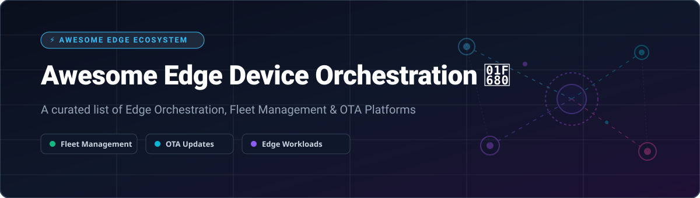

# Awesome Edge Device Orchestration 🚀

  
  
  
  
  
  

## 🌐 Overview & Ecosystem Map

Welcome to the **Awesome Edge Device Orchestration** ecosystem guide! 🌐 This curated repository tracks top-tier **SaaS platforms** and production-ready **open-source projects** for **Edge Device Orchestration**, **Fleet Management**, **Remote Provisioning**, **Over-The-Air (OTA) Updates**, and **Edge Workload Orchestration**.

Whether you are deploying lightweight Kubernetes clusters across thousands of remote IoT gateways, managing OTA firmware rollbacks on microcontrollers, or orchestrating GPU-accelerated AI models at the enterprise edge, this guide helps infrastructure architects, DevOps engineers, and embedded developers select the optimal tooling.

---

## 📑 Table of Contents

- [☁️ SaaS / Hosted Platforms](#-saas--hosted-platforms)
- [🔓 Open-Source Projects](#-open-source-projects)
  - [☸️ Lightweight Kubernetes for Edge](#️-lightweight-kubernetes-for-edge)
  - [📦 Edge Orchestration & Control Planes](#-edge-orchestration--control-planes)
  - [📡 Device Management & IoT Frameworks](#-device-management--iot-frameworks)
  - [🔄 OTA Updates & Firmware Management](#-ota-updates--firmware-management)
  - [⚡ Edge AI & Virtualization](#-edge-ai--virtualization)
- [🤝 How to Contribute](#-how-to-contribute)
- [💖 Support & Sponsorship](#-support--sponsorship)
- [📈 Star History](#-star-history)
- [⚠️ Disclaimer](#️-disclaimer)

---

## ☁️ SaaS / Hosted Platforms

> [!NOTE]
> **Market Size & Industry Structure:**  
> The global Edge Device Orchestration & Management sector is estimated at **$5.2 Billion (2026)** and is projected to expand at a CAGR of ~28% through 2032. The sector is **highly fragmented**, characterized by specialized category leaders across virtualization, container fleets, and OTA security rather than a single "winner-take-all" platform.

The table below summarizes top commercial and hosted SaaS edge management platforms, sorted in descending order by **Company Scale / Valuation / Funding**:

| Platform 🚀 | Description 📝 | Pricing (Specific Starting Tier) 💵 | Free Tier Limit / Trial 🆓 | Company Scale / Revenue / Valuation 🏢 |
| :--- | :--- | :--- | :--- | :--- |
| **[Canonical Ubuntu Core](https://ubuntu.com/core)** | Immutable, transactional Linux OS for IoT and edge devices with snap packaging and automatic rollbacks. | Free OS; Commercial support starts at **$25/device/year** (Ubuntu Pro for Infrastructure) | **Free for personal use** on up to 5 machines (Ubuntu Pro free tier) | **~$345M Annual Revenue** (Canonical Ltd.) |
| **[ZEDEDA](https://zededa.com/)** | Cloud-native edge virtualization and zero-trust orchestration platform built on Linux Foundation EVE-OS. | Custom Enterprise quote (typically starts at **~$2–$5/device/month** at volume) | **30-Day Free Trial** (Includes full cloud dashboard & demo cluster access) | **~$400M Valuation** ($130M total VC raised) |
| **[Foundries.io](https://foundries.io/)** | Cloud-native DevSecOps platform (FoundriesFactory) for building and updating secure Linux IoT & edge devices. | Commercial plans start at **$1,500/month** (Flat fee per product line, unlimited devices) | **Free Community Edition** for non-commercial development & evaluation | **Acquired by Qualcomm** in 2024 ($1M–$10M ARR subsidiary) |
| **[Balena](https://www.balena.io/)** | Container-based IoT fleet management platform (balenaCloud) with automated OTA updates and remote access. | Prototype plan starts at **$159/month** (includes first 20 devices, $2/device extra) | **Free Forever for up to 10 devices** (Full balenaCloud feature access) | **~$8.3M Annual Revenue** ($35.1M total VC funding) |
| **[Portainer](https://www.portainer.io/)** | Centralized container management platform for Docker, Kubernetes, and Swarm across cloud and edge nodes. | Portainer Business starts at **$149/year** (per environment/cluster node) | **Free Forever for up to 3 nodes** (Portainer Business 3-node free license) | **~$4.7M Annual Revenue** (~$13.4M total VC funding) |
| **[Mender](https://mender.io/)** | End-to-end OTA software update manager for embedded Linux devices and microcontrollers (Zephyr RTOS). | Basic hosted plan starts at **$34/month** (includes 50 devices) | **12-Month Free Trial** for Enterprise plan (up to 10 devices, no credit card required) | **~$870K Annual Revenue** (Northern.tech subsidiary) |

---

## 🔓 Open-Source Projects

Below is a curated list of active open-source edge orchestration repositories. Each project features a live GitHub Stars_Count badge that links directly to its stargazers page. Sorted by **GitHub Stars_Count (Descending)** 🌟.

### ☸️ Lightweight Kubernetes for Edge

- **[K3s](https://github.com/k3s-io/k3s)**   
  Lightweight, fully compliant Kubernetes distribution packaged as a single binary. Optimized for resource-constrained edge gateways and ARM/x86 devices.

- **[MicroK8s](https://github.com/canonical/microk8s)**   
  Zero-ops, pure upstream Kubernetes distribution by Canonical. Includes built-in high availability, automatic updates, and edge add-on management.

- **[K0s](https://github.com/k0sproject/k0s)**   
  Frictionless, single-binary Kubernetes distribution with zero host dependencies. Supports x86-64, ARM64, and RISC-V architectures for versatile edge deployments.

### 📦 Edge Orchestration & Control Planes

- **[KubeEdge](https://github.com/kubeedge/kubeedge)**   
  CNCF Graduated Kubernetes-native edge computing framework. Extends native container orchestration to edge nodes with offline autonomy and MQTT device state sync.

- **[OpenYurt](https://github.com/openyurtio/openyurt)**   
  CNCF Hosted open-source platform extending upstream Kubernetes to edge compute scenarios, supporting node autonomy, edge-cloud network tunneling, and unit orchestration.

- **[Baetyl](https://github.com/baetyl/baetyl)**   
  LF Edge project extending cloud computing, data processing, and AI inference to edge devices with support for 30+ industrial protocols and MLflow integration.

- **[SuperEdge](https://github.com/superedge/superedge)**   
  An open-source container management system for edge computing that extends native Kubernetes to edge sites without modifying core Kubernetes code.

- **[Eclipse ioFog Agent](https://github.com/eclipse-iofog/Agent)**   
  Complete open-source edge computing platform for running microservices at scale. Features universal edge container environment, Skupper overlay networking, and air-gapped deployment support.

### 📡 Device Management & IoT Frameworks

- **[EdgeX Foundry](https://github.com/edgexfoundry/edgex-go)**   
  LF Edge project building an open, vendor-neutral microservice framework for IoT edge computing and interoperability between industrial devices and clouds.

- **[Intel Edge Manageability Framework (EMF)](https://github.com/open-edge-platform/edge-manageability-framework)**   
  Open-source edge manageability stack from Intel's Open Edge Platform for zero-touch provisioning, hardware/software telemetry, cluster orchestration, and governance.

- **[Fledge](https://github.com/fledge-iot/fledge)**   
  LF Edge open-source framework for Industrial IoT (IIoT), focused on sensor integration, data aggregation, edge analytics, and cloud streaming.

### 🔄 OTA Updates & Firmware Management

- **[RAUC](https://github.com/rauc/rauc)**   
  Safe and secure lightweight update client for embedded Linux devices. Handles A/B dual-bank updates with cryptographic signature verification.

- **[Mender Engine](https://github.com/mendersoftware/mender)**   
  Open-source OTA software update manager for Linux devices and MCU microcontrollers, providing atomic dual-system updates with automatic rollback.

- **[Eclipse hawkBit](https://github.com/eclipse-hawkbit/hawkbit)**   
  Domain-independent backend framework for rolling out software and firmware updates to constrained edge devices, gateways, and IoT nodes.

### ⚡ Edge AI & Virtualization

- **[ACRN Hypervisor](https://github.com/projectacrn/acrn-hypervisor)**   
  Flexible, lightweight open-source reference hypervisor built with safety-critical workloads and IoT edge virtualization in mind.

- **[nos](https://github.com/nebuly-ai/nos)**   
  Open-source Kubernetes module designed to optimize GPU utilization at the edge for AI model inference and resource scheduling.

- **[EVE-OS (Project EVE)](https://github.com/lf-edge/eve)**   
  LF Edge Edge Virtualization Engine providing open, standardized hardware-assisted virtualization and container runtimes for enterprise edge nodes.

- **[Sedna (KubeEdge)](https://github.com/kubeedge/sedna)**   
  Edge AI suite powered by KubeEdge, enabling joint cloud-edge AI inference, incremental learning, federated learning, and lifetime learning.

---

## 🤝 How to Contribute

Contributions are warmly welcomed! 💖 If you know an awesome edge device orchestration tool, OTA updater, or lightweight Kubernetes platform that should be included:

1. Fork this repository. 🍴
2. Add your entry to `README.md` keeping formatting consistent (include name, links, description, and Stars_Badges).
3. Submit a Pull Request (PR) with a brief summary of the project.

Please check existing items before submitting to prevent duplicate entries!

---

## 💖 Support & Sponsorship

If you find this curated list valuable for your edge infrastructure research or projects, please consider supporting the project:

- ⭐ **Star this repository** to help others discover it!
- 🔀 **Fork & Share** with your colleagues, DevOps team, or IoT community.
- ☕ **Sponsor / Buy Me a Coffee:** Support ongoing maintenance and curation on the [GitHub Sponsor Dashboard](https://github.com/sponsors/ishandutta2007).

Thank you for your support! 🙏

---

## 📈 Star History

---

## ⚠️ Disclaimer

- This list is **community-curated** for informational and research purposes only and does not constitute an endorsement.
- Edge device orchestration platforms handle high-privilege device credentials and remote execution capabilities; always perform thorough security reviews before deploying in production environments.
